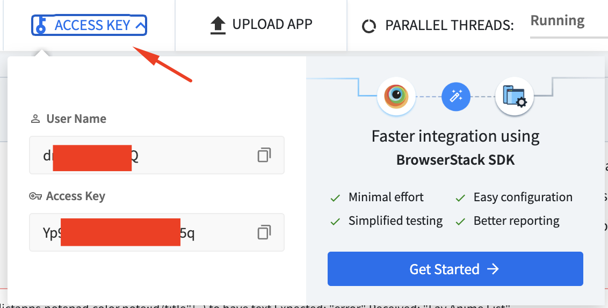

# js-webdriverIO-appium-allure

This project provides the ability to integrate webdriverIO into the Continuous Integration (CI) process, allowing mobile Android and iOS tests to be run automatically. The results of test execution are processed and presented in the form of a detailed Allure report, which contains full information about each test, including its steps, parameters, answers and possible errors with screenshots, as well as video of the test process stored on [Browserstack](https://app-automate.browserstack.com/builds/038a6d40b2e6b348e02c7c58049f3ce4e46f34ca/sessions/651e4c178c60b63acec40092f5f5373ac2c2e692?auth_token=3780f8d9fe04d0201f7b57b985f16fb83ed90dfe698ab4eab20719c935da36e0). This provides visibility and convenience when analyzing test results, allowing you to quickly identify and fix problems.

## Сontent
- [Technology](#Technology)
- [Requirements](#Requirements)
- [Installation](#Installation)
- [Execution](#Execution)
- [Report](#Report)
- [License](#License)

## Technology
- [WebdriverIO](https://webdriver.io/)
- [Appium](https://www.npmjs.com/package/appium)
- [Browserstack](https://www.browserstack.com/)
- [Allure](https://allurereport.org/)

## Requirements
To install and run the project, you need [NodeJS](https://nodejs.org/), [Android Studio](https://developer.android.com/studio), [Java](https://www.java.com/) version 8 or above.

## Installation

1. Install Allure-Report

2. Install the npm package using the command:
```sh
npm install
```

## Execution

1. Register your user at [Browserstack](https://www.browserstack.com/). You will be given 100 free minutes of virtual device usage (Android, iOS)

- Copy the `User Name` and `Access Key` values and paste them into the `./config/wdio.android.bs.conf.js` configuration file in the `config.user` and `config.key` variables respectively.




- Download the test app `./app/android/ColorNote+Notepad.apk` on the [Browserstack](https://www.browserstack.com/) website under `UPLOAD APP` section


- Copy the ID of the downloaded Apk and paste it into the `./config/wdio.android.bs.conf.js` configuration file in the `config.capabilities` object `app` property.


2. To execute the test, run the command:
```sh
npx wdio run config/wdio.android.bs.conf.js -spec test/specs/android/add-note-screen.spec.js
```
- `test/specs/android/add-note-screen.spec.js` =>  test file in the `test` folder
- `config/wdio.android.bs.conf.js` => file with test preconfigurations
- The files for the report will be generated, based on the results of the collection in the `allure-results` folder.

3. Execute the command to generate a report to the `allure-report` folder:
```sh
allure generate
```
4. Execute the command to open the report in a browser:
```sh
allure serve
```

## Report


### Browserstack - video test


## License
This project is licensed under the MIT License - see the [LICENSE](LICENSE) file for details
